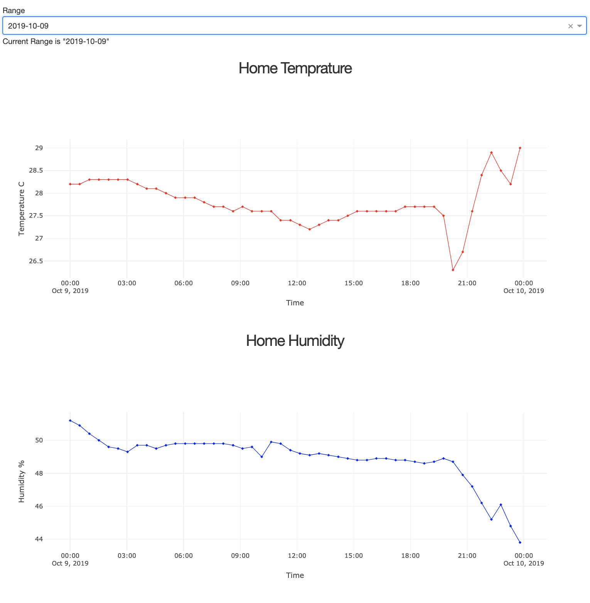
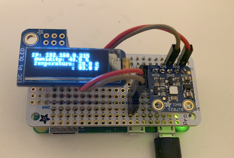

# Pi Zero Temperature Sensor + Webserver

A temperature and humidity sensor (Si7021) with an OLED screen on top of Pi Zero. 
The OLED shows temperature in C and F, and humidity. It is refreshed every 15 seconds.
In the background, the average of every half an hour is recorded in a csv file. 
The csv file is later read by [pandas](https://pandas.pydata.org/), and 
[Dash](https://plot.ly/dash/) for the webserver for visualization.
You have a basic selection of the days for the range of dates in the
csv file. You can access it on `http://[pi_ip]:8050/`, and should show something like:




What's inside:
- [Raspberry Pi Zero W](https://www.adafruit.com/product/3400)
- [Adafruit PiOLED - 128x32 Monochrome OLED](https://www.adafruit.com/product/3527)
- [Adafruit Si7021 Temperature & Humidity Sensor](https://www.adafruit.com/product/3251)
- [Adafruit Perma Proto Bonnet Mini Kit](https://www.adafruit.com/product/3203)
- Some cable and solder

Software:
- Latest version of [HypriotOS](https://blog.hypriot.com/)
- Flash it to your SD card with this guide we made [here](https://parallel-ml.github.io/docs/getting-started/setting-up-pi/)
- Set your WiFi network in `/etc/wpa_supplicant/wpa_supplicant.conf` based on the guide.
- SSH to your pi, after finding its IP on your local WiFi: `pi@192.168.x.x`
- `git clone` this repo, I assume at /home/pi for the rest.
- Install pandas and dash with pip3.
- To startup the codes create `/etc/rc.local`, `chmod +x /etc/rc.local`, and edit it with `sudo vim /etc/rc.local`
```BASH
#!/bin/sh
#
# rc.local - executed at the end of each multiuser runlevel
#
# Make sure that the script will "exit 0" on success or any other
# value on error.

sudo echo "$(date +%s),$(date),$(uname -a)"  >> /home/pi/logs/reboot.log
sudo python3 /home/pi/boot_oled.py > /dev/null 2>&1
sudo python3 /home/pi/update_oled.py > /dev/null 2>&1 &
sudo python3 /home/pi/app.py > /dev/null 2>&1 &
```
## Additional Tools On My Pi
* Network Wide ad Blocker: [Pi-Hole](https://github.com/pi-hole/pi-hole)
